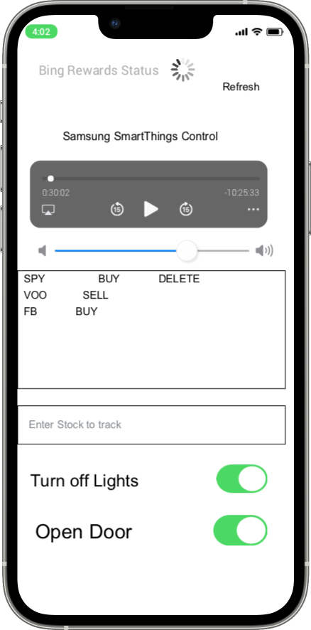

# OMNI App
## Purpose
Become more comfortable with iOS and development tools. 

The reason I built this app was for three things:
1) A consolidated app to control IoT Smart Home Things (like lights and door switches)
2) Tell me the status of my bing rewards spammer, and give me a alert when my bing status spammer is done 
3) Let me add stocks/monitor stocks potentially to buy/sell in my portofolio 

## Future Modifications
Add support for smart home opener

## WireFrame
Final Product will look more polished

## Setup
To get the app to work on xcode, you will need to create a Constants.swift file 
and add the following modified as per your project

import Foundation

class Constants {
    func Constants(){}

    let lightSwitch="device ID for light switch"

    let tv="device ID for tv"

    let apiToken="api token from Samsung Developer API...PAT token (Personal Access Token) "

    let bingSpammerURL="url for bing spammer url"

}

